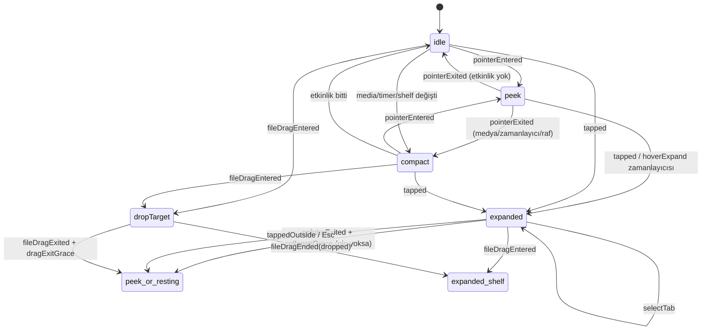

# OpenIsland — Teknik Mimari

Bu belge; izin modelini, kullanılan public/private framework'leri, çentik pencere yönetimini,
durum makinesini ve her özelliğin sistem düzeyindeki uygulamasını açıklar.

---

## 1. Katmanlar

```
┌──────────────────────────────────────────────────────────────────────────┐
│ App           OpenIslandApp · AppDelegate · AppEnvironment (DI kökü)      │
│               IslandCoordinator (servis olayları → durum makineleri)      │
├──────────────────────────────────────────────────────────────────────────┤
│ Window        ScreenManager · NotchWindowController · NotchPanel          │
│               NotchSensorPanel (dinlenme girdisi) · IslandContainerView    │
├──────────────────────────────────────────────────────────────────────────┤
│ Island (VM)   IslandViewModel: olay → reducer → spring animasyonu + efekt │
├──────────────────────────────────────────────────────────────────────────┤
│ UI            IslandRootView · IslandShape · IslandDesign (token + yaylar) │
│               WaveformView · TimeProgressView (Core Animation)            │
├──────────────────────────────────────────────────────────────────────────┤
│ Features      Media · HUD · Shelf · Mirror · Clipboard · Events ·         │
│               Focus (Pomodoro + Takvim) · Notes/Launcher · Gestures       │
├──────────────────────────────────────────────────────────────────────────┤
│ IslandCore    IslandMachine (saf reducer) · IslandLayoutEngine ·          │
│ (saf, test)   CompactPulse · kurallar      — AppKit bağımlılığı yok        │
└──────────────────────────────────────────────────────────────────────────┘
```

- **IslandCore** yan etkisizdir; tüm davranış kuralları ve geometri burada birim testleriyle
  doğrulanır (`Tests/IslandCoreTests`; güncel test sayısı `swift test` çıktısında).
- Servisler `@Observable` (Observation framework) sınıflarıdır; SwiftUI yalnızca okuduğu
  özellik değişince yeniden çizer. **Combine yerine Observation** tercih edildi: macOS 14+
  hedeflendiği için özellik düzeyinde bağımlılık takibi, `ObservableObject`'in tüm-nesne
  invalidasyonundan daha ucuzdur. Servis → durum makinesi olayları ise düz closure'larla
  (`onPlaybackChange`, `onHUD`…) koordinatöre akar; böylece akış açık ve izlenebilir kalır.
- Tüm UI ve servis durumu `@MainActor`'dadır. Gerçek zamanlı işler (ses IO, kamera oturumu,
  AppleScript) kendi seri kuyruklarında çalışır ve sonuçlarını ana aktöre `Sendable` değerlerle taşır
  (Swift 6 strict concurrency, 0 uyarı).

---

## 2. İzinler (TCC) ve yetkiler

| İzin | Neden | Info.plist anahtarı | Entitlement (Hardened Runtime) | Ne zaman istenir | İzin yoksa |
|---|---|---|---|---|---|
| **Erişilebilirlik** | Pano geçmişinde ⌘C/⌘X'i anında yakalamak (yalnızca `flagsChanged` global izleyicisi; ⌘ basılıyken geçici `keyDown`) | — | — | Ayarlar › Sistem Erişimi (`AXIsProcessTrustedWithOptions`) | Pano geçmişi uygulama değişiminde ve ada açılışında güncellenir. İzin verildiğinde `com.apple.accessibility.api` bildirimiyle otomatik etkinleşir. Tuş yakalama (event tap) yoktur (Revizyon 18) |
| **Kamera** | Quick Mirror | `NSCameraUsageDescription` | `com.apple.security.device.camera` | Ayna sekmesi ilk açıldığında | Ayna sekmesi izin yönlendirmesi gösterir |
| **Otomasyon (Apple Events)** | Spotify / Müzik bilgi + kontrol | `NSAppleEventsUsageDescription` | `com.apple.security.automation.apple-events` | Uygulama çalışırken ilk AppleScript'te | O oynatıcı için AppleScript kaynağı devre dışı |
| **Takvimler (tam erişim)** | Yaklaşan etkinlikler | `NSCalendarsFullAccessUsageDescription` | `com.apple.security.personal-information.calendars` | Nook/Odak'ta "Erişim ver" veya Sistem Erişimi | Takvim sütunu erişim düğmesi gösterir |
| **Anımsatıcılar (tam erişim)** | Bugünkü anımsatıcılar, tamamlama, ekleme | `NSRemindersFullAccessUsageDescription` | `com.apple.security.personal-information.calendars` (EventKit ortak) | Nook/Odak'ta "Erişim ver" veya Sistem Erişimi | Liste erişim düğmesi gösterir; ada etkilenmez |
| **Pano erişimi** (macOS 15.4+ modeli) | Pano geçmişi | — | — | İlk içerik okumada (sistem) | `accessBehavior == .alwaysDeny` ise izleme durur |
| **Bildirimler** | Pomodoro bitişi | — | — | İlk açılışta (yalnızca .app paketi) | Sessiz; yalnızca ses çalar |

**Sistem Erişimi ekranı** tüm izinleri tek listede gösterir: *İzin verildi / İzin verilmedi / Kullanımda
sorulur / Desteklenmiyor*, her biri için kısa bir neden ve tek bir eylem (izin iste veya ilgili Sistem
Ayarları bölmesini aç). Durumlar yalnızca bu ekran açıldığında
ve uygulama yeniden etkinleştiğinde okunur; açılışta izin sorgusu yapılmaz. Hiçbir izin zorunlu değildir.

**Sandbox kapalıdır.** Global olay izleyicisi (⌘C), `/usr/bin/perl`, `/usr/bin/ditto` ve `/usr/bin/shortcuts`
alt süreçleri, private framework'ler (SkyLight, MediaRemote) ve rastgele uygulamalara Apple Event gönderme sandbox
içinde mümkün değildir.
Bu nedenle dağıtım Mac App Store yerine **Developer ID + notarization** (GitHub Releases, Homebrew
cask, Sparkle ile güncelleme) şeklindedir. Hardened Runtime açıktır; notarization için şarttır.

> Geliştirme ipucu: ad-hoc imzada (`codesign -s -`) her derlemede cdhash değişir ve TCC izinleri
> sıfırlanır. Sabit bir "Apple Development" sertifikası ile imzalayın; Apple Developer hesabı yoksa
> `Scripts/create-dev-identity.sh` bir kez çalıştırılarak kendinden imzalı yerel bir kimlik
> ("OpenIsland Local Signing") oluşturulur ve `build-app.sh` onu kendiliğinden seçer.

---

## 3. Framework haritası

### Public

| Framework | Kullanım |
|---|---|
| **AppKit** | `NSPanel`, `NSScreen` (safeAreaInsets, auxiliaryTopLeft/RightArea), `NSEvent` global/local monitor, `NSPasteboard` (general + drag), `NSSharingService` (AirDrop), `NSWorkspace`, `NSHapticFeedbackManager` |
| **SwiftUI + Observation** | Tüm ada arayüzü, spring animasyonları, `matchedGeometryEffect`, `TimelineView`, `MenuBarExtra`, `Settings` |
| **CoreGraphics** | `CGDisplayIsBuiltin`, `CGWindowListCopyWindowInfo` (tam ekran algılama, pencere görünürlüğü doğrulaması). Tuş yakalama (`CGEvent.tapCreate`) Revizyon 18'de kaldırıldı |
| **IOKit (ps)** | `IOPSNotificationCreateRunLoopSource` — pil/şarj bildirimleri. Harici monitör DDC/CI değerlendirildi, uygulanmadı (§8) |
| **CoreAudio / AudioToolbox** | `kAudioHardwareServiceDeviceProperty_VirtualMainVolume`, mute (okuma/yazma ve değişim dinleyicisi); aygıt listesi ve varsayılan çıkış dinleyicileri (AirPods bildirimi). Ses kaydı veya analiz yok |
| **AVFoundation** | `AVCaptureSession` + `AVCaptureVideoPreviewLayer` (aynalı önizleme). Oturum ilk Ayna açılışında oluşturulur |
| **EventKit** | Tek, tembel `EKEventStore` (`EventStoreProvider`): `requestFullAccessToEvents/Reminders`, 24 saatlik etkinlikler, bugünkü anımsatıcılar, `EKEventStoreChanged` |
| **QuickLookThumbnailing** | Raf öğesi küçük resimleri |
| **ImageIO** | Pano görsellerini belleğe tam açmadan küçültme; raftaki "Resmi sıkıştır" (`CGImageSourceCreateThumbnailAtIndex`, `CGImageDestination`) |
| **ServiceManagement** | `SMAppService.mainApp` — oturum açılışında başlatma |
| **UserNotifications** | Pomodoro bildirimleri |
| **Foundation** | `DistributedNotificationCenter` (Spotify/Music), `NSAppleScript`, `Process` (`/usr/bin/ditto`: raftaki Zip'le / Arşivi aç; `/usr/bin/shortcuts`) |

### Private (dlopen/dlsym veya ObjC runtime ile — link-time bağımlılık yok)

| Framework | Sembol | Kullanım | Risk / Yedek |
|---|---|---|---|
| **MediaRemote** | `MRMediaRemoteGetNowPlayingInfo`, `…RegisterForNowPlayingNotifications`, `…SendCommand`, `…SetElapsedTime` | Sistem geneli "Şimdi Çalıyor" (web oynatıcılar dahil) | **macOS 15.4+**: bilgi okuma `com.apple.*` dışı süreçlere kapalı → `mediaremote-adapter` (Apple imzalı `/usr/bin/perl` içinde çalışır). Komut gönderme hâlâ çalışır. Son yedek: Spotify/Müzik AppleScript |
| **SkyLight** | `SLSMainConnectionID`, `SLSSpaceCreate`, `SLSShowSpaces`, `SLSAdd/RemoveWindowsFromSpaces`, `SLSHideSpaces`, `SLSSpaceDestroy`; doğrulama için `SLSCopySpacesForWindows` (CGS önekli adlar yedek) | `PrivateSpaceProvider`: adanın pencereleri Dock'un yönetmediği bir Space'te, Space/tam ekran geçiş animasyonuna katılmaz (§4.1.1). Uygulamada Space ile ilgili private sembollerin tamamı bu tek dosyada | Sembol yoksa, pencere ekranda görünmüyorsa veya hâlâ kayan bir Space'in üyesiyse `SpacePresentationController` public sağlayıcıya düşer (görünür, geçişte kayar); durum Ayarlar'da görünür, uyanma/kilit açma/ekran değişiminde yeniden denenir |

Uygulamada yalnızca **iki** private framework vardır: SkyLight (Space yalıtımı) ve MediaRemote (Şimdi Çalıyor).
Ekran parlaklığı (DisplayServices) ve klavye aydınlatması (CoreBrightness) Revizyon 18'de kaldırıldı: bu tuşlar
her zaman macOS'un kendi göstergesine kalır. Her private çağrı "yoksa sessizce devre dışı kal, native davranışa
dön" ilkesine uyar; bir macOS güncellemesi sembolü kaldırırsa uygulama çökmez.

- Ses seviyesi yazımı (public Core Audio) `IslandCore/LevelControl.swift` içindeki `ManagedLevelControl`
  üzerinden yapılır: aralık dışı veya NaN değer ve başarısız yazma sayılır; art arda 3 hatada kontrol devre dışı
  kalır, uyanmada ve ses aygıtı değişiminde sıfırlanır. Davranış birim testleriyle doğrulanır (sahte arka uç).

---

## 4. Çentik pencere yönetimi (Window Server)

### 4.1 `NotchPanel` konfigürasyonu

| Ayar | Değer | Gerekçe |
|---|---|---|
| `styleMask` | `.borderless, .nonactivatingPanel, .fullSizeContentView` | Çerçevesiz; tıklamada uygulama **aktifleşmez**, kullanıcının odağı çalınmaz |
| `level` | Görsel `.mainMenu + 3`; sensör `.mainMenu + 4` | Menü çubuğunun, status item'ların ve tam ekran uygulamanın önünde (ölçüldü); ekran koruyucunun (1000) ve kilit ekranının altında |
| Space | `SpacePresentationController` → private / public / güvenli yedek sağlayıcı (§4.1.1) | Space/tam ekran geçiş animasyonuna katılmaz, her Space'te ekranda kalır; bozulursa görünür kalarak yedeğe düşer |
| `collectionBehavior` | `.canJoinAllSpaces, .canJoinAllApplications, .stationary, .fullScreenAuxiliary, .ignoresCycle` | SkyLight yoksa geçerli yedek: tüm uygulama ve Space'lerde görünür; Cmd+\` döngüsüne girmez |
| `isOpaque / backgroundColor / hasShadow` | `false / .clear / false` | Şeffaf tuval; gölge SwiftUI'da şekle göre çizilir |
| `ignoresMouseEvents` | dinamik | Varsayılan `true` (tıklamalar alttaki pencerelere geçer); imleç adanın üzerindeyken `false` |
| `becomesKeyOnlyIfNeeded` + `canBecomeKey` | `true` | Yalnızca metin alanına (Quick Notes) tıklanınca key olur; kapanınca `relinquishKeyFocus()` odağı geri verir |
| `hidesOnDeactivate`, `isMovable`, `animationBehavior` | `false`, `false`, `.none` | Asla gizlenmez/taşınmaz; AppKit pencere animasyonu yok |
| `NSHostingView.sizingOptions` | `[]` | SwiftUI içerik boyutu pencereyi yeniden boyutlandırmaz |
| `safeAreaInsets` override | `.zero` | Çentik safe-area boşluğu içeriği aşağı itmez |
| `acceptsFirstMouse` | `true` | Aktif olmayan paneldeki ilk tıklama doğrudan düğmeye gider |

#### 4.1.1 Space geçişlerinden bağımsızlık (`SpacePresentationController`)

**Kök neden (ölçüldü, `SLSCopySpacesForWindows`):** `canJoinAllSpaces` pencereyi Dock'un yönettiği **her** Space'e
(masaüstleri ve tam ekran uygulamalar) ayrı ayrı üye yapar. Geçişte WindowServer bu Space katmanlarını kaydırır;
ada da içlerinde olduğu için kayar. Pencerenin çerçevesi hiç değişmez; `setFrame` ile "geri yerleştirme" işe
yaramaz. `.stationary` yalnızca Mission Control/Exposé içindir.

**Mimari** (`Sources/OpenIsland/Window/SpacePresentation/`):

```
OpenIsland (NotchWindowController: attach / detach)
  → SpacePresentationController   sıra, doğrulama, yedeğe düşme, kendini onarma, durum
      → PrivateSpaceProvider      Dock'un yönetmediği WindowServer Space'i (tüm private semboller burada)
      → PublicStationaryProvider  canJoinAllSpaces + canJoinAllApplications + stationary + fullScreenAuxiliary
      → SafeFallbackProvider      public yapılandırmayı yeniden uygular + öne alır (yalnızca görünürlük)
```

Kararlar saf ve testlidir (`SpacePresentationPolicy`, IslandCore):
- **Davranış:** ekranda değil → `hidden`; kayan Space üyesi → `slides`; üyelik okunamıyor → `unverified`;
  aksi halde → `pinned`.
- **Kabul:** private yalnızca `pinned`/`unverified` ise kabul edilir. Public ve güvenli yedek görünür kaldıkça
  kabul edilir; kayma bilinen sınırdır, kaybolma asla kabul edilmez.
- **Birleştirme:** en kötü pencere genel durumu belirler.

**Doğrulama, çağrının hata vermemesine değil sonuca dayanır.** Her kurulumdan ve her Space değişiminden sonra her
pencere için iki sorgu yapılır: WindowServer'a göre ekranda mı, kayan bir Space'in üyesi mi (adanın kendi Space'i
hariç). Üyelik ile kayma cihazda birebir örtüştü; üyelik yoklama gerektirmeyen, güvenilir bir göstergedir.
Sağlayıcı kabul edilmezse etkisi geri alınır ve sıradakine geçilir. Yedekteki pencereler uyanma, ekran uyanması,
kilit açma ve ekran değişiminde birincilden yeniden denenir. Uyanmada kısa, sınırlı yeniden denemeler yapılır
(0,25 / 0,75 / 2 sn) ve mevcut Space yeniden gösterilir. Durum Ayarlar › Sistem Erişimi › Ada penceresi'nde ve
tanılama kaydında görünür.

**A/B ölçümü** (gerçek OpenIsland, iki mod, ~175 Hz, `SLSGetScreenRectForWindow`: pencerenin animasyon sırasındaki
gerçek ekran konumu, ekran kaydı gerekmez). Her senaryoda aynı anda public ayarlı bir kontrol penceresi de
ölçüldü; geçişin olduğunu ve ölçüldüğünü kanıtlar.

| Senaryo | private (birincil) | public |
|---|---|---|
| Masaüstü 1 → 2 / 2 → 1 (Ctrl+ok) | 0,0 pt | 1773 / 1774 pt |
| Art arda hızlı → ← → ← (150 ms) | 0,0 pt | 1774 pt |
| Masaüstü ↔ tam ekran, tam ekrana giriş/çıkış | 0,0 pt | 1687–3548 pt |
| Tam ekran ↔ tam ekran | 0,0 pt | 5230 / 5322 pt |
| Mission Control aç/kapa | 0,0 pt | 266 pt |
| Kullanıcının trackpad testi (dört parmak, yavaş/hızlı, masaüstü ↔ tam ekran, tam ekrana giriş/çıkış; 12 Space değişimi, 120 sn) | **0,0 pt**, 0 hareketli örnek | — |

Sonuç: public yöntem her senaryoda, en kritik olan masaüstü → masaüstü geçişinde de kayıyor; birincil olamaz.

**Diğer public adaylar da denendi** (tam ekran ↔ tam ekran, Ctrl+ok, aynı ölçüm): `canJoinAllSpaces + stationary +
fullScreenAuxiliary` panel seviye 25 (NotchNook'unki), 101, 1000, 1500 ve `CGShieldingWindowLevel` (2147483628) →
hepsi tüm yönetilen Space'lerin üyesi, 3547–3548 pt kaydı. `NSStatusItem` penceresine alt pencere olarak bağlamak da
işe yaramadı: bu sürümde durum simgelerini `MenuBarAgent` çiziyor ve uygulamanın `NSStatusBarWindow`'u gerçek bir
WindowServer penceresi değil (numara 4294967296); bağlanan panel yine 3548 pt kaydı. Menü çubuğu da her Space'te ayrı
bir pencere. Yönetilen Space dışında kalan pencereler yalnızca sistem süreçlerine (`MenuBarAgent`) ait. **Kaymayan
bir ada için public bir yol yok**; yalnızca private Space yalıtımı bunu sağlıyor.
Public pencere kayan Space'lerin üyesidir, yani animasyonun parçasıdır. Bunu engelleyen public bir API yoktur.
Private birincil kalır, public otomatik yedektir.

**Bozulma taklitleri** (ayrı kopya derlemeler, cihazda):

| Taklit | Sonuç |
|---|---|
| (a) Space gösterilmiyor (ada ekrandan düşer) | public'e düştü, ada hep ekranda, uygulama çalışıyor, tanılama 18/18 |
| (b) Pencere Space'e eklenmiyor (yalıtım etkisiz) | public'e düştü, ada hep ekranda, 18/18 |
| (c) SkyLight sembolleri yok | baştan public (`unverified`), ada hep ekranda, 18/18 |

**Ölçüm aracı:** `./Scripts/space-probe.sh [saniye]` (`Tools/SpaceProbe`). Adanın pencerelerini ölçerken
dört parmakla kaydırın ya da tam ekrana girip çıkın. Sonunda her pencere için en büyük yatay sapma, ekranda kalıp
kalmadığı, kayan Space üyeliği ve "SABİT ✅ / KAYDI ❌" yazılır. Araç cihazda doğrulandı: public modda
"KAYDI ❌ 1774 pt", private modda "SABİT ✅ 0,0 pt".

**Yeniden yalıtma (ölçüldü):** `AddWindowsToSpaces` tek başına pencereyi yalnızca macOS'un Space'lerine
yerleşmeden önce (açılışta `orderFront` ile aynı turda) yalıtır. Yerleşmiş pencere (açılıştan 0,3 sn sonra,
yedekten dönüşte, ekran değişiminde) eklendikten sonra da yönetilen Space'lerde kalıyor ve kayıyordu. Cihazda ada,
bir süre sonra bu yüzden kalıcı olarak yedekte bulundu. Kurulum artık önce ekler, sonra yönetilen üyelikleri
`RemoveWindowsFromSpaces` ile açıkça kaldırır. Bu sırayla pencere hiçbir an Space'siz kalmaz. Yerleşmiş
pencerede, yedeğe düşüp geri dönüşte, masaüstü geçişlerinde ve tam ekrana giriş/çıkışta kalıcı olduğu ölçüldü
(2062 örnek, 0,0 pt).

**Birincilden düşüşte sınırlı yeniden deneme:** Pencere görünür kalsın diye önce hemen yedeğe alınır, sonra
birincil 1, 3 ve 10 sn'de yeniden denenir. Başarıda sayaç sıfırlanır; gerçekten bozuksa üç denemeden sonra durur
(döngü yok). Taklitle doğrulandı: ilk iki "ekranda değil" okumasında ada yedeğe düştü, görünür kaldı ve
~2,3 sn'de yeniden sabitlendi.

**A/B yeniden denemek için** (ör. yeni bir macOS sürümünden sonra):
`defaults write io.github.openisland.OpenIsland spacePresentationProvider public` komutunu çalıştırıp uygulamayı
yeniden başlatın ve ölçüm aracıyla bütün senaryoları tekrarlayın. Public ancak hepsinde "SABİT ✅" çıkarsa
`SpacePresentationPolicy.measuredOrder` içinde öne alınmalıdır. Geri almak için:
`defaults delete io.github.openisland.OpenIsland spacePresentationProvider`.

**Doğrulanamayanlar:** Split View, masaüstü ekleme/silme, uyku/uyanma, çözünürlük değişimi, harici monitörde
kaydırma. Bunlar ayrı ayrı ölçülmedi. Aynı mekanizma geçerlidir; bozulursa doğrulama yedeğe düşürür. Görsel
kayma ekran görüntüsüyle değil, pencerenin gerçek ekran konumuyla ölçüldü.

### 4.2 İki pencere: sabit görsel tuval + görünmez girdi sensörü

Önceki sürümde tek pencere hover'da büyüyüp yay durunca küçülüyordu. WindowServer yeni çerçeveyi anında
uygularken SwiftUI içeriği bir kare sonra yeniden yerleşiyor, o karede ada yeni sol kenara göre
çizildiği için **sağa zıplayıp geri geliyordu**. Bunun çözümü yuvarlama değil, mimari:

| Pencere | Boyut | Görev |
|---|---|---|
| `NotchPanel` (görsel) | **Sabit** tuval (`IslandLayoutEngine.canvasSize`: en büyük görünüm + gölge + yay aşımı); yalnızca ekran değişiminde `setFrame` | Tüm morph Core Animation'da; pencere animasyon sırasında hiç yeniden boyutlanmaz |
| `NotchSensorPanel` (girdi) | Dinlenmedeki ada kadar (+ ekranın üst kenarına kadar), görünmez | Hover (`NSTrackingArea`), tıklama, dosya sürükleme (`NSDraggingDestination`), trackpad jestleri |

Girdi yönlendirmesi:

| Durum | Sensör | Görsel panel |
|---|---|---|
| Dinlenme (idle/compact, HUD/bildirim dahil) | fareyi alır | fareyi geçirir |
| Yükseltilmiş, imleç içeride veya sürükleme sürüyor | geçirir | alır; hover çıkışı tracking area ile |
| Yükseltilmiş, imleç dışarıda (tolerans / pin / kilit / demo) | açık adanın hover alanını kaplar; yeniden girişi kendi tracking area'sı yakalar | geçirir; dış tıklama için yalnızca global + yerel `leftMouseDown` |

Son satır Revizyon 20'de değişti: önceden burada global `mouseMoved` + `leftMouseDragged` izleyicisi vardı ve
sabitlenmiş (veya demo modundaki, Quick Look açıkken tutulan) adada imleç başka yerde gezindikçe uygulama her
harekette uyanıyordu. Cihazda 60 Hz harekette sürekli %1,2–1,5 CPU ölçüldü; şimdi %0,0. Sensör yeniden girişi
yakalayınca hemen fareyi geçirir ve panelin hover alanı "imleç içeride" varsayımıyla yenilenir; sonraki çıkış
panelden gelir. Bu durumda sensöre giren dosya sürüklemesi de aynı devir yoluyla panele geçer.

**Mutlak simetri**: tüm genişlikler çift tam noktaya yuvarlanır (`symmetricWidth`, aşağı yuvarlama;
dinlenmedeki şekil donanım çentiğini asla taşmaz). Tuval de çift genişliktedir ve piksel hizalı çentik
merkezine göre kurulur. Böylece adanın kenarları `merkez ± genişlik/2` olur ve 1× ile 2× ekranlarda tam
piksele düşer: genişleme iki yana birebir aynı piksel sayısıyla dağılır. Ölçüm: sensör ve tuval merkezi
= ekran merkezi (855,0 pt, sol/sağ pay 0).

Sensörün boyutu HUD veya bildirim gibi geçici katmanlara göre değil, dinlenme fazının kendisine göre
seçilir. Böylece geçici genişlemeler menü çubuğu öğelerinin tıklamalarını engellemez; duran bir imlecin
altında genişleyen bir bildirim adayı kendiliğinden açmaz.

### 4.3 Olay güdümlü hover ve tıklama geçirgenliği

- **Hover ile açılma**: sensöre girişte ada hafifçe kabarır (peek); varsayılan 180 ms beklemeden sonra
  kendiliğinden genişler. Beklemeden önce çıkılırsa açılmaz (menü çubuğuna giderken yanlışlıkla açılma
  olmaz). Gecikme Ayarlar'dan 80–500 ms arasında değiştirilebilir. Tıklama beklemeden anında açar.
- **Yükseltilmiş adada hover**: görsel panelin `NSTrackingArea`'sı. İmleç zaten içerideyse `.assumeInside`
  ile kurulur; böylece pencere fareyi yeni kabul etmeye başladığında bile çıkış kaçırılmaz.
- **Kapanma**: imleç ayrılınca yüzey önce söner (`isRelaxing`), 0,35 sn tolerans dolunca çentiğe karışır.
- Yerleşim imlecin altında küçüldüğünde yalnızca **çıkış** bir kez doğrulanır; girişler hiçbir zaman
  yapay olarak üretilmez.

### 4.4 `ScreenManager` — çentik koordinatları

```
notch.width  = screen.frame.width − auxiliaryTopLeftArea.width − auxiliaryTopRightArea.width
notch.height = screen.safeAreaInsets.top
notch.origin = (frame.minX + leftArea.width, frame.maxY − notch.height)   // AppKit global koordinat
```

- `safeAreaInsets.top == 0` veya yardımcı alanlar `nil` → **çentiksiz** → `NotchMetrics.pill`
  (180 pt genişlik, menü çubuğu + 6 pt yükseklik), ada menü çubuğunun ortasında **yüzen kapsül** olur.
- `NSApplication.didChangeScreenParametersNotification` ile monitör tak/çıkar, çözünürlük değişimi,
  clamshell modu izlenir; `IslandCoordinator` ekran başına bir `NotchWindowController` uzlaştırır.
- Ekran seçimi `DisplaySelection` (IslandCore, testli):
  - `DisplayTarget.primary` ("Yalnızca MacBook ekranı", varsayılan): çentikli dahili ekran, yoksa dahili ekran.
    Harici monitörde ada **hiç görünmez**; kapak kapalıyken (yalnızca harici monitör) ada yoktur. Eskiden bu
    durumda menü çubuğunun olduğu ekrana, yani harici monitöre düşülüyordu.
  - `DisplayTarget.allDisplays`: her ekranda bir ada (çentikli olanda notch, diğerlerinde pill); kullanıcı bilerek
    seçer.
- Ses, parlaklık ve klavye ışığı tuşları hiçbir zaman yakalanmaz; her zaman macOS'un kendi göstergesi çalışır
  (§6.3).

---

## 5. Durum makinesi (`IslandCore/IslandMachine.swift`)



**Tasarım kararları**

1. **Saf reducer**: `mutating func send(_:) -> [IslandEffect]`. Zamanlayıcı ve haptic, efekt olarak
   döner; `IslandViewModel` bunları `Task.sleep` / `NSHapticFeedbackManager` ile çalıştırır.
2. **Jeton (token) ile iptal**: her etkileşim `interactionToken`'ı artırır. Eski jetonla gelen
   `timerFired` yok sayılır → "imleç çıktı, 300 ms içinde geri girdi" durumunda ada kapanmaz.
3. **HUD bir faz değil, katmandır**: `hud` ayrı tutulur ve `presentation` hesaplanırken çözülür.
   Kapalı/compact/peek iken HUD adayı kaplar; genişletilmişken içerik bozulmaz, altta banner çıkar.
   HUD bitince önceki faza "geri dönme" mantığına gerek kalmaz.
4. **Dinlenme fazı (resting)**: etkileşim yokken öncelik `medya > zamanlayıcı > raf > idle`.
   Etkinlik değişimleri yalnızca `idle/compact` iken fazı değiştirir; kullanıcı etkileşimini bölmez.
5. **Pin**: sabitlenmiş ada dış tıklamayı ve imleç çıkışını yok sayar; Esc pin'i kaldırıp kapatır.
6. **Sönümlenme (decay)**: imleç ayrılınca `isRelaxing` açılır; yüzey kritik sönümlü bir yayla
   %0,6 küçülür (enerjisini kaybeder), ardından tolerans (0,35 sn) dolunca çentiğe karışır.
   İmleç geri gelirse jeton geçersiz olur ve yüzey eski haline döner.
7. **Haptic anları** efekt olarak döner (`HapticMoment`): açılma haptic'i tıklamada değil, yay
   hedefe mantıksal olarak ulaştığında çalınır. Hover'da hiçbir zaman haptic yoktur.
8. **Animasyon evreleri** (expanding/collapsing) makinede değil, view model'in transaction katmanında
   yaşar; makine küçük ve test edilebilir kalır.
9. **Demo modu** (`demoModeChanged`, ekran kaydı ve sunum için): pin gibi imleç çıkışını ve dış tıklamayı yok
   sayar, bekleyen kapanmayı iptal eder; ek olarak duraklatılan medyanın bekleme süresi dolmaz ve koordinatör tam
   ekranı yok sayar. Pin'den farkı: Esc/kısayol adayı kapatır ama demo modunu kapatmaz; ada her açılışta açık
   kalmaya devam eder. Kapanınca normal kurallar kaldığı yerden işler (imleç dışarıdaysa kapanma, duraklatılmış
   medya için yeni bekleme). Saklanmaz; uygulama her açılışta kapalı başlar. Testli.

### 5.1 Hareket sistemi (`UI/IslandDesign.swift`)

Değerler aşım formülünden seçildi: `aşım = e^(−ζπ / √(1−ζ²))`, tepeye varış `t = π / (ω√(1−ζ²))`, `ω = 2π / response`.
Ayarlar › Genel › **Hareket**: *Canlı* (varsayılan) / *Sakin* / *Azaltılmış*. Ham değerler eski ayarlarla uyumludur
(`expressive` / `natural` / `reduced`); sistemin "Hareketi Azalt" ayarı her zaman Azaltılmış'ı seçer. Stil,
içerik geçişlerine de `EnvironmentValues.islandMotionStyle` ile ulaşır.

| Geçiş | Canlı (varsayılan) | Sakin |
|---|---|---|
| Açılma (→ expanded / drop) | `response 0,30`, `ζ 0,74` → tepe ~0,22 sn, ~%3 aşım | `response 0,44`, `ζ 0,78` → ~%2 aşım, yumuşak |
| Kapanma | `response 0,22`, `ζ 1` → ~0,2 sn, aşımsız | `response 0,50`, `ζ 0,94` → sekmesiz, ~0,5 sn |
| İmleç çıkınca kapanmadan önce bekleme | 0,18 sn | 0,35 sn |
| Bildirim | `response 0,32`, `ζ 0,76` | `response 0,42`, `ζ 0,8` |
| Hover kabarması (+10×4 pt) | `response 0,24`, `ζ 0,70` | `response 0,30`, `ζ 0,72` |
| İçerik belirme / sönme | 30 ms gecikme, `response 0,22` / `0,12` | 60 ms gecikme, `0,34` / `0,16` |
| HUD, sönümlenme | ortak: HUD `0,30 / ζ 0,86`, sönümlenme `0,55 / ζ 1` | ← |
| Hareketi Azalt | `response 0,24`, `ζ 1`: aşım yok, içerik yalnızca opaklık | ← |

**Cihazda ölçülen (Canlı, Revizyon 18, ekrandan 13 ms aralıkla örnekleme):** açılışta alt kenar 0,15 sn'de hedefin
%98'ine varır, 0,21 sn'de tepeye ulaşır (2,5 pt ≈ %2 aşım); kapanış ~0,15–0,2 sn. (NotchNook ölçümü: açılış tepesi
0,26 sn, %5,6 aşım; kapanış 0,22 sn.)

İçerik geçişi ölçek kullanmaz (açılır pencere hissi vermemesi için): yüzey büyümeye başladıktan hemen sonra
içerik bulanıklıktan netleşir, kapanırken hızla söner. Azaltılmış'ta (Hareketi Azalt ve pil tasarrufu) bulanıklık
filtresi hiç kurulmaz, yalnızca opaklık (Revizyon 23; bulanıklık yoğun geçiş dizisinde adanın WindowServer
maliyetinin ~%20'si). `blendDuration` sayesinde yarıda kesilen bir animasyon
(hızlı giriş/çıkış) hızını koruyarak yeni hedefe akar.

### 5.2 İçerik temelli genişletilmiş geometri ve başlık

Görsel panel (`NotchPanel`) sabit bir tuvaldir ve yeniden boyutlanmaz: `canvasSize` her görünümün en büyük halini
(`ExpandedContent.maximum`, Nook Üretkenlik) taşır. Küçülen şey, kullanıcının gördüğü siyah gövdedir:
- gövde şekli, arka plan, içerik ve kırpma şekli her görünümün kendi hedef boyutuna morph eder;
- merkez fiziksel çentikte kalır, genişlik iki yana simetrik değişir, yükseklik aşağı doğru büyür.

**Genişlemiş çentik (Revizyon 18):** açık ada ayrı bir açılır pencere gibi değil, fiziksel çentiğin doğal devamı
gibi görünür:
- üst kenar ekranın tavanında ve çentiğe kesintisiz bağlıdır; üst köşelerde çentiğin kendi köşeleri gibi küçük
  içbükey kulaklar (10 pt), altta sıkı sürekli eğrilik (28 pt; eskiden kart gibi 32);
- notch'ta gölge ve cam kenar ışığı yoktur (`elevation 0`, `edgeHighlight 0`): gövde saf #000000'dır, çentik
  bandında ve altında hiç piksel yoktur (tanılama betiği denetler). Çentiksiz ekrandaki pill yüzen kapsül olarak
  ayrışmaya devam eder;
- bırakma hedefi aynı kulak ve köşeleri kullanır.

**Boyut hesabı:**
- Gövde = gerçek içerik + yan boşluk (10 kulak + 10) + başlık (çentik + 2) + alt boşluk (10). Revizyon 18'de
  yalnızca bu dış boşluklar küçüldü; içerik ölçüleri ve yerleşimi aynıdır (testli: içerik yüksekliği birebir aynı,
  içerik genişliği aynı veya daha geniş). Üst sınırlar da aynı miktarda indi (Nook 680 → 672, raf 560 → 552);
  kayan içerik alanı değişmedi.
- Gerçek içerik `ExpandedContent` sayılarından (pano, raf, etkinlik, anımsatıcı, başlatıcı) ve panellerle ortak
  ölçülerden (`IslandLayoutEngine.Notes/.Clipboard/.Shelf/.Focus/.Mirror`) hesaplanır.
- Sayılar Observation ile izlenir (yoklama yok).

**Başlık:**
- Tüm sekmeler her zaman doğrudan tıklanabilir ("⋯" yok) ve her görünümde aynı yerde durur (çentiğe yaslı).
- Sıra: solda Müzik, Nook, Raf, Pano; sağda Odak, Notlar, Ayna ve iğne. Kapalı modüllerin sekmesi gösterilmez.
- Sekmeler 20 × 24 pt'dir. Her yandaki 4 öğe 185 pt çentikte 369 pt'lik gövdeye sığar: gövdenin alt sınırı budur
  (eskiden 30 pt'lik sekmelerle 489, sonra 427, 377, 373).

Ölçüler (185 × 33,5 pt çentik; cihazda tanılama betiğiyle çizilen gövdeden):

Ortak ölçüler: içerik boşluğu 10 pt, başlık–içerik arası 2 pt, başlık kenar boşluğu 12 pt.

| Görünüm | İlk (sabit) | Revizyon 9 | Revizyon 17 | Şimdi (18) | İçeriğe göre |
|---|---|---|---|---|---|
| Quick Note | 516 × 193,5 | 377 × 152,5 | 373 × 140,5 | **369 × 136,5** | başlatıcı 0–3: 126,5 yükseklik |
| Pano (7+ öğe) | 508 × 205,5 | 390 × 162,5 | 386 × 152,5 | **378 × 148,5** | 1 öğe 100,5 · 2 öğe 119,5 · 3+ 148,5 (kayar) |
| Raf (boş) | 500 × 173,5 | 377 × 153,5 | 373 × 147,5 | **369 × 143,5** | 1–3 öğe 369 × 152,5 · 10 öğe 552 (kayar) |
| Odak | 522 × 173,5 | 416 × 149,5 | 388 × 137,5 | **380 × 133,5** | etkinlik sayısından bağımsız |
| Medya | 532 × 161,5 | 422 × 149,5 | 396 × 137,5 | **388 × 133,5** | satır içi süre çubuğu, 88 pt kapak |
| Nook (Dengeli) | 667 × 149,5 | 659 × 145,5 | 651 × 137,5 | **643 × 133,5** | Sade 458, Üretkenlik 672 |
| Ayna | — | 416 × 203,5 | 388 × 189,5 | **380 × 185,5** | 140 pt önizleme |
| Bırakma hedefi | — | — | 460 × 145,5 | **456 × 141,5** | karo alanı aynı |

Görsel panel (tuval) 766 × 258 → 766 × 244 → 758 × 240 pt.

**Nook takvim widget'ı** (170 × 88 pt):
- solda ay kısaltması (sistem dili), sağda bugünü merkeze alan 5 günlük şerit (bugün sistem vurgu renginde,
  seçili gün dairede); altta seçili günün en fazla 2 etkinliği + "+N";
- izin yoksa "Takvimini bağla": karar verilmemişse izin sorar, reddedilmişse Sistem Ayarları'nı açar;
- ay adı ve boş durum Takvim'i, etkinlik o etkinliği açar.

---

## 6. Özellikler — sistem düzeyinde uygulama

### 6.1 Medya + ses nabzı
- **Kaynak zinciri** (`MediaController`): `MediaRemoteAdapterSource` (paketlendiyse) →
  `MediaRemoteSource` (macOS < 15.4) → `ScriptedPlayerSource` (Spotify, Müzik). Çalan kaynak
  duraklatılmış olana, sistem geneli kaynak uygulamaya özel olana üstün gelir. Komutlar aktif
  kaynağa; kaynak yoksa `MRMediaRemoteSendCommand`'a gider (herhangi bir oynatıcı).
- **Spotify/Müzik**: `com.spotify.client.PlaybackStateChanged` / `com.apple.Music.playerInfo`
  dağıtık bildirimleri + tek Apple Event'le `{ad, sanatçı, albüm, süre, konum, durum}`. Kapak:
  Spotify `artwork url`, Müzik `raw data of artwork 1`. `tell application` hedefi başlatacağı için
  her sorgudan önce `NSRunningApplication` kontrolü yapılır. AppleScript ayrı seri kuyrukta çalışır.
- **Süre çubuğu**: `TimeProgressView` kalan süre boyunca tek bir `CABasicAnimation` kurar; çubuk
  render sunucusunda akar, uygulama süreci kare başına uyanmaz. Etiketler tam saniye sınırlarında ve
  yalnızca çalarken güncellenir (`PausablePeriodicSchedule`). Tıklama veya sürükleme ile sarılır; sürüklerken
  kalınlaşır ve süre anlık güncellenir, bırakınca seek gönderilir. Arka uç komutu reddederse (adapter çıkış
  kodu, AppleScript hatası, eksik sembol) kaydırıcı gerçek konuma döner. Canlı yayında (süre 0) veya seek
  desteklemeyen kaynakta çubuk salt okunurdur (`MediaSource.supportsSeeking`).
- **Kaynak uygulamaya geçiş**: kapak veya başlığa tıklamak müziği çalan uygulamayı öne getirir
  (`NowPlayingInfo.bundleIdentifier`; web oynatıcıda tarayıcı). Uygulama kapalıysa başlatılmaz, kaynak
  bilinmiyorsa tıklama alınmaz. Hızlı işlemler (oynat, atla, sar) adada kalır.
- **Kalıcı medya katmanları**: albüm kapağı ve dalga biçimi durumlar arasında yeniden oluşmaz;
  `IslandLayoutEngine.artworkSlot/waveformSlot` yuvaları arasında yüzeyle aynı yayla akar. Kapak
  yarıçapı her durumda gövdeyle eş-merkezlidir (`dış yarıçap − boşluk`).
- **Müzik nabzı** (`WaveformView`): Dynamic Island tarzı 5 ince, tam yuvarlak çubuk.
  - **Yerleşim:** kompakt medyada solda kapak, ortada fiziksel çentik, sağda çubuklar. Çentiğin üzerine içerik
    çizilmez, ada büyümez. Çubuklar mevcut kanat yuvasına (23 × 12 pt) sığar: 2,5 pt kalınlık, 2 pt aralık,
    kapakla ayna simetrisi için sağ kenara yaslı.
  - **Hareket biçimi:** her çubuk ayrı bir `CALayer`; `bounds.size.height` kendi dikey merkezinden büyür, grubun
    merkezi sabittir. Renk sıcak açık amber (`IslandPalette.pulse`, parıltı yok).
  - **Tamamen tahmini:** kompakt, hover, bildirim ve genişletilmiş medyada ses kaydedilmez ve analiz edilmez.
    Bu nabız bileşeninde ses yakalama, spektrum motoru veya ses izni kullanılmaz. Ayrı Ses Mikseri
    özelliği, ara uygulama ses seviyeleri için sistem sesi izniyle bellekte Core Audio işleme yapar.
    - Desenler `IslandCore/CompactPulse` içinde elle tasarlanmıştır ve testlerle doğrulanır.
    - Her çubuğun kendi aralığı, 10 değerlik deseni, fazı ve adım süreleri var (bir iniş-çıkış 0,68–1,05 sn).
    - Birleşik hareket ~1200 saatte bir tekrar eder; beşi birden asla tepeye çıkmaz; ortalama yükseklik ~0,55.
    - Çubuk başına tek bir `CAKeyframeAnimation` render sunucusunda döner (üst sınır 30 Hz). Süreç yalnızca
      çalıyor/duraklatıldı değişiminde uyanır.
  - **Duraklatılınca:**
    - Kompakt medya 3 sn daha kalır (`pausedMediaLinger`). Çubuklar 0,2 sn'de görünen yükseklikten sakin forma
      (▃▂▃▂▃) iner; sonra hiç animasyon kalmaz.
    - Bu sürede yeniden çalınırsa kanat kapanmaz, çubuklar 0,2 sn'de desene girer.
    - Süre dolunca ada çentiğe döner. Parça kalmadıysa (`mediaSessionEnded`) beklemeden kalkar.
  - **Ölçüm** (aynı süreçte çalıyor/duraklatıldı karşılaştırması):
    - Kaldırılan gerçek ses hattı kompakt ritimde uygulamada %0,3–0,5, ses sunucusunda (coreaudiod) %1,7–2,7
      ek CPU tutuyordu.
    - Eski tahmini nabız denemesinde uygulama CPU'su kullanılan aracın hassasiyetinde sıfıra yuvarlandı;
      bu bileşen için ses girişi ve IO geri çağrısı yoktur.
    - Hareket render sunucusunda da iş yapar. Önceki WindowServer/GPU toplam değerleri OpenIsland'a
      özel bir yüzde olarak yorumlanamaz; son ölçüm ve sınırlar [performans raporundadır](PERFORMANCE.md).

### 6.2 File Shelf & sürükle-bırak
- **Native drop hedefi**: ada penceresi dinlenmede tam çentik kadardır ve fare olaylarını kabul eder;
  dosya çentiğe sürüklendiğinde sistem `DropDelegate.dropEntered`'ı çağırır → `fileDragEntered` →
  ada drop hedefine morph eder (haptic: kilitlendi). Sürükleme dışarı çıkarsa 0,45 sn tolerans
  (`dragExitGrace`), geri gelirse iptal. Global sürükleme izleyicisi yoktur.
- **İki bölge**: "Rafa bırak" (referans olarak tut; görseller önbelleğe kopyalanır) ve "AirDrop"
  (`NSSharingService(.sendViaAirDrop)`).
- **Dışarı sürükleme**: her öğe `NSItemProvider(contentsOf:)` ile Finder'a, Mail'e, Slack'e vb.
  bırakılabilir; bağlam menüsü: Aç, Finder'da Göster, AirDrop, Kopyala, dosya işlemleri, Kaldır.
- **Dosya işlemleri** (eylem çubuğundaki "İşlemler" menüsü ve bağlam menüsü; seçime uygun olanlar gösterilir):
  - *Zip'le*: `/usr/bin/ditto -c -k --sequesterRsrc` (Finder'ın "Sıkıştır" biçimi). Tek öğe `--keepParent` ile
    "<ad>.zip"; birden fazla öğe APFS klonlarıyla geçici bir klasörde toplanıp "Arşiv.zip" olur.
  - *Arşivi aç* (yalnızca .zip): `ditto -x -k` gizli bir geçici klasöre; tek üst öğe doğrudan yanına çıkar
    (iç içe "Proje/Proje" oluşmaz), birden fazlası arşivin adında klasöre; `__MACOSX` atılır.
  - *Resmi sıkıştır* (jpg, png, heic, tiff, bmp, webp): ImageIO, uzun kenar ≤ 2560 px, EXIF yönü uygulanır, konum
    gibi meta veriler taşınmaz. Gerçekten saydam pikseli olan görsel PNG kalır, diğerleri JPEG (%75) olur
    (macOS ekran görüntüleri alfa kanallı ama opak PNG'dir; piksel taramasıyla ayırt edilir). Sonuç orijinalden
    küçük değilse hiçbir dosya bırakılmaz.
  - *Yolu kopyala*: seçili öğelerin yolları, satır başına bir tane.
  - Çıktı Finder'daki gibi orijinalin yanına yazılır (yazılamıyorsa rafın klasörüne); var olan dosyanın üzerine
    yazılmaz ("Arşiv 2.zip"), orijinaller değişmez. Çıktı rafa eklenip seçilir, sonuç eylem çubuğunda 3 sn görünür.
  - İşlemler arka planda çalışır. Kurallar (uygunluk, adlandırma, hedef boyut, tutma kararı)
    `IslandCore/ShelfOperations.swift` içindedir ve testlidir.
- Önizleme: `QLThumbnailGenerator` (anında `NSWorkspace` ikonu yer tutucu).

### 6.3 Ses göstergesi (HUD)
- **Tuş yakalama yoktur** (Revizyon 18): event tap, `MediaKeyInterceptor`, DisplayServices ve CoreBrightness
  kaldırıldı. Ses, parlaklık ve klavye ışığı tuşları her zaman macOS'un kendi göstergesine gider; bu yol için
  Erişilebilirlik izni ve private çerçeve gerekmez, macOS güncellemelerinde kırılacak bir şey kalmaz.
- Adadaki ses göstergesi yalnızca uygulamanın kendi yaptığı ayarlarda açılır: trackpad jesti (dikey kaydırma) ve
  UI kaydırıcıları. Seviye public Core Audio `VirtualMainVolume` ile yazılır (`ManagedLevelControl`, §3);
  aygıt yazılımsal sesi desteklemiyorsa (HDMI) ayar yapılmaz.
- **`VolumeObserver`** (Core Audio dinleyicisi, izin gerektirmez) kodda durur ama varsayılan olarak kapalıdır
  (`setObservesVolume(false)`): sistemdeki ses değişimleri adada HUD açmaz, macOS göstergesiyle çift gösterim
  olmaz. Açılırsa jest yolunun yazdığı değer, ardından gelen aynı Core Audio bildiriminde (1,5 sn, ±0,01)
  tekilleştirilir; varsayılan çıkış değişince dinleyici yeni aygıta taşınır ve taşındıktan sonraki 1 sn'deki
  değişim gösterilmez.
- **Otomatik ses ayarları HUD açmaz (`VolumeChangeRules`, IslandCore, testli):** AirPods Pro'nun Kişiselleştirilmiş
  Ses özelliği sesi kendiliğinden %1–2'lik adımlarla, ~0,6–1,5 sn'de bir değiştirir (cihazda 60 sn'de 16 değişim
  ölçüldü). Bu yolda HUD yalnızca belirgin adımda (≥ 0,04; ses tuşu 1/16, Bluetooth'ta 8/127), sessize alma/açmada
  veya en üste varışta açılır. Karşılaştırma bir önceki okumayla yapılır; küçük kaymalar birikerek eşiği aşmaz.
  Bu kural `VolumeObserver` açıldığında geçerlidir.

### 6.4 Quick Mirror
`AVCaptureSession` (.high) + `AVCaptureVideoPreviewLayer`; bağlantıda `isVideoMirrored = true`,
150 pt daire maskesi. Oturum yalnızca Ayna sekmesi görünürken çalışır (`onAppear/onDisappear`),
böylece yeşil kamera LED'i sekmeden çıkınca söner. Kare işlenmez/kaydedilmez.
Oturum çalışma hatası veya kamera ayrılması dinlenir; Ayna açıkken kamera baştan bağlanır (en fazla 2 deneme, sonra "Yeniden dene"; Revizyon 28).

### 6.5 Üretkenlik araçları
- **Pano geçmişi** (yoklamasız): uygulama geçişi (`didActivateApplicationNotification`), ⌘C/⌘X
  (yalnızca `flagsChanged` izlenir; ⌘ basılıyken geçici `keyDown` izleyicisi) ve ada açılışı
  tetikler. Kopyanın kaynağı olarak önceki uygulama atanır. Parola yöneticisi türleri
  (`org.nspasteboard.ConcealedType/TransientType`) atlanır; görseller ImageIO ile ≤640 px PNG'ye
  küçültülür; yalnızca metin/dosya öğeleri diske yazılır. macOS 15.4+ `accessBehavior` gözetilir.
- **Pomodoro**: bitiş anı `Date` olarak tutulur (uyku/saat kaymasına dayanıklı); tek bir
  `Task.sleep(bitişe kadar)`; bitince ses + bildirim + faz ilerlemesi (4 odakta bir uzun mola).
  Zamanlayıcı çalışırken ada kapalıyken kanatlarda halka + geri sayım gösterir. Oturum (faz, çalışıyor /
  duraklatıldı, tamamlanan odak sayısı) yalnızca durum değişiminde `UserDefaults`'a yazılır ve yeniden açılışta
  sürdürülür (`FocusSessionRestore`, IslandCore, testli): çalışan oturum aynı bitişe hizalanır, duraklatılmış
  oturum kalan süreyle döner, kapalıyken süresi dolan faz sessizce bir sonrakine geçer (ses/bildirim yok).
- **Takvim**: 24 saatlik etkinlikler; konum/not/URL içindeki Zoom/Meet/Teams/Webex/FaceTime
  bağlantısı `NSDataDetector` ile bulunur → "Katıl" düğmesi.
- **Quick Notes**: tek Markdown dosyası, 600 ms debounce ile atomik kayıt; pin ile ada açık kalır.
- **Launcher**: uygulamalar (`NSOpenPanel`) ve Apple Shortcuts (`/usr/bin/shortcuts list/run`).

### 6.6 Geçici bildirimler (transient island)

Makinede HUD gibi bir üst katman olan `notice` vardır. Önceliği HUD'un altında, temel fazın üstündedir.
Görünüm: kanatlarda simge ve değer, çentiğin altında tek satır açıklama. Yüzey `notice` yayıyla
(ζ 0,8) iki yana ve aşağı uzar; süre dolunca `collapse` yayıyla söner. Süreler tek yerde, `NoticeTiming`
(IslandCore) token'larındadır: tek bakışlık onay 1,4 sn (renk, kilit), aygıt 1,8 sn (AirPods, AirDrop), parça
değişimi 2,0 sn, dosya/zamanlayıcı 2,4 sn, adaptör 2,6 sn, düşük pil 3,5 sn, kritik pil ve toplantı 4,0 sn.
İmleç bildirimin üzerindeyken süre dolarsa bildirim kapanmaz; imleç ayrılınca 0,8 sn daha kalır.
Genişletilmiş adada içeriği kapatmaz, alt kenarda bir kapsül olarak görünür.

Tüm bildirimler tek bir sunum modelinden (`NoticePresentation`) çizilir. Öncelik deterministiktir ve
`IslandMachine`'de test edilir: daha düşük öncelikli bir bildirim, gösterilen daha yüksek öncelikli bildirimi
kesmez; süren bir canlı etkinlik (ör. indirme) kendisinden düşük öncelikli bildirimleri (ör. "renk
kopyalandı") bastırır. Tam ekranda yalnızca acil bildirim (kritik pil) gösterilir. HUD bu modelin dışındadır.

| Bildirim | Kaynak (hepsi olay güdümlü) |
|---|---|
| Pil / şarj: adaptör bağlandı/kesildi, %20, %10, %100 | `IOPSNotificationCreateRunLoopSource` (IOKit). Geçiş kuralı `IslandCore/PowerRules.swift` içinde, test edilir. Dolum animasyonlu pil simgesi; yeşil / sarı / kırmızı |
| Ses çıkışı bağlandı / ayrıldı (AirPods, kulaklık, HDMI) | Core Audio `kAudioHardwarePropertyDefaultOutputDevice` + `kAudioHardwarePropertyDevices` dinleyicileri; tür `kAudioDevicePropertyTransportType` ve ad ile belirlenir. Kural `AudioOutputRules` (IslandCore, testli): listeye Bluetooth aygıtı eklendi → bağlandı (macOS çıkışı ona geçirmese bile); Bluetooth aygıtı ya da o an çıkış olan harici aygıt kayboldu → ayrıldı; çıkış dahili olmayan bir aygıta geçti → bağlandı. Aynı aygıt 5 sn içinde iki kez duyurulmaz; ağda beliren AirPlay hoparlörü seçilmedikçe duyurulmaz. Public API; Bluetooth izni gerekmez. AirPods pil seviyesi için güvenilir bir public API olmadığından **gösterilmez** |
| Kilit açıldı | `com.apple.screenIsUnlocked` dağıtık bildirimi (ayarla kapatılabilir). `com.apple.screenIsLocked` ve `NSWorkspace.sessionDidResignActive` yarım kalan animasyonu iptal eder, açık adayı kapatır. Oturum açılışında başlatılırsa (`loginwindow` süreci en fazla 120 sn önce başlamışsa) ilk karede oynar |
| Parça değişimi ("sneak peek") | `MediaController`. Kalıcı kapak ve dalga katmanları kanatlara akar |
| Toplantı 5 dk önce | EventKit. Yalnızca bir sonraki etkinlik için tek bir uyuyan görev |
| Pomodoro fazı bitti | `FocusTimer` |
| İndirme tamamlandı | `NSProgress` yayını (aşağıda) |
| Renk kopyalandı | `NSColorSampler` |
| AirDrop gönderildi | `NSSharingServiceDelegate.didShareItems` |

### 6.7 Canlı etkinlikler ve araçlar

- **Dosya aktarımı**: `Progress.addSubscriber(forFileURL:)` ile `~/Downloads`, `/Applications` ve
  `~/Applications` dinlenir. Safari/Chrome, AirDrop, Finder ve App Store yalnızca ilgili klasöre
  `NSProgress` yayımladıklarında izlenebilir. App Store'un her macOS sürümünde bu yayını yaptığı
  varsayılmaz; yayının olmadığı sürümlerde ilerleme göstergesi üretilemez. Uygulama paketlerinin
  adı `.app` / `.appdownload` uzantısı olmadan gösterilir. Abonelikler timer, klasör taraması veya ağ sorgusu kullanmaz.
  Aktarım sürerken kanatlarda ilerleme halkası ve yüzde görünür; bu etkinlik diğerlerinden önceliklidir.
  KVO bildirimleri tam yüzde adımlarına indirgenir. AirDrop **gönderiminin** ilerlemesi için public API
  yoktur; tamamlanınca bildirim gösterilir.
- **Raf**:
  - Finder gibi seçim: tıklama tek seçer, ⌘ ekler/çıkarır, ⇧ aralık seçer; "Tümünü seç" düğmesi var.
  - Quick Look: `NotchPanel` responder zincirinde `QLPreviewPanelController` rolünü üstlenir.
  - Çok öğeli sürükleme: AppKit `beginDraggingSession` ile öğe başına bir `NSDraggingItem`, yığın
    görünümünde; Mail, Finder ve Slack topluca kabul eder.
  - Quick Look, AirDrop sayfası, dosya seçici ve bağlantı penceresi açıkken `holdChanged` adayı açık tutar.
- **Başlatıcı**: uygulamalar, **web bağlantıları** (simge olarak bağlantıyı açacak tarayıcının simgesi
  kullanılır, favicon için ağ isteği yapılmaz) ve Apple Shortcuts.
- **Renk damlalığı**: `NSColorSampler` (ekran kaydı izni gerekmez) → sRGB HEX panoya kopyalanır; son
  12 renk saklanır.
- **Klavye kısayolu ⌃⌥⌘I**: Carbon `RegisterEventHotKey`. Erişilebilirlik izni gerekmez, her tuş vuruşunu
  dinlemez. Açılınca panel key olur, Esc ile kapanır.
- **Ada menüsü (sağ tık veya Control-tık)**: Adayı aç/kapat, Adayı açık tut (pin), Demo modu, Ayarlar…,
  OpenIsland'den Çık. Dinlenmede görünmez sensörün `rightMouseDown`'ı, açıkken hosting view'un `menu(for:)`'u
  gösterir; SwiftUI'nin kendi bağlam menüsü olan içerik (raf öğesi, metin alanı) önceliklidir. Menü açıkken
  `IslandHold` adayı açık tutar. Menü izleme döngüsü sürerken AppKit hover çıkışını teslim etmeyebildiği için
  (cihazda görüldü: ada "imleç içeride" sanıp açık kaldı) menü kapanınca imlecin gerçek konumu bir kez
  doğrulanır. Ayarlar, SwiftUI'nin `openSettings` eylemiyle açılır (kök görünümden alınır).
- **Demo modu**: §5 madde 9. Ada menüsünden, menü çubuğu menüsünden veya Ayarlar › Genel › Sistem'den açılır;
  saklanmaz, kayıtlı hiçbir ayarı (ör. "Tam ekranda") değiştirmez.
- **Ayarlarda ada önizlemesi**: Ayarlar › Genel'in başında; gerçek `IslandLayoutEngine` ve `IslandShape` ile
  kompakt medya ↔ Nook arasında seçili hareket stilinin yaylarıyla açılıp kapanır (üzerine gelme, tıklama veya
  stil değişimi). Yalnızca etkileşimde çizer.

### 6.8 Jestler ve floating pill
- `NSEvent.addLocalMonitorForEvents(.scrollWheel)`: olay yalnızca imleç panelin üzerindeyken gelir.
  `hasPreciseScrollingDeltas` (trackpad/Magic Mouse), eksen kilidi 8 pt; yatay 60 pt → parça
  değiştir (tek tetik; varsayılan sola → sonraki, "Medya jestini ters çevir" ayarıyla sağa → sonraki), dikey her
  12 pt → ±1/32 ses (+HUD). `isDirectionInvertedFromDevice` ile
  "doğal kaydırma" normalize edilir; momentum olayları yutulur. Genişletilmiş görünümde olaylar
  içerikteki ScrollView'lara bırakılır.
- Çentiksiz ekranlarda `IslandStyle.pill`: aynı durum makinesi ve görünümler. `IslandShape` pill yolunu
  çizer. Kapsül `NotchMetrics.floatOffset` ile menü çubuğunun **hemen altında** yüzer; ince kenar ışığı ve
  hafif gölgeyle masaüstünden ayrışır. Sensörün üst kenarı ekranın tepesine uzandığı için imleci ekranın
  üst-ortasına götürmek yeterlidir.

---

## 7. Performans ve Apple Silicon

**Boşta (ada kapalı/kompakt, aktif işlem yok)**: sürekli zamanlayıcı veya yoklama yoktur. Olay
izleyicileri bulunur: çentik sınırı, dosya sürükleme, uygulama geçişi, pano kısayolları, ekran/izin,
pil, ağ yolu ve ses aygıtı bildirimleri. Dock önizlemeleri açıksa gelen fare hareketlerinde ucuz bir
ekran kenarı kontrolü yapılır; fare dururken konum sorgulayan bir döngü yoktur. Son pencerede çıkış
özelliği tıklama ve AX pencere olaylarını dinler. Aktif ses işleme, aktarım veya zaman göstergeleri
boşta senaryosundan ayrıdır. Ses/parlaklık donanım tuşları yakalanmaz.

Güncel ölçüm yöntemi, CPU senaryo tablosu, GPU/pil sınırları ve yeniden çalıştırma komutları:
[Docs/PERFORMANCE.md](PERFORMANCE.md).

**Albüm renginde nabız (`PulseTint`, IslandCore, testli):** nabız çubuklarının rengi parça değişince bir kez,
kapağın 24 × 24 pikseline göre hesaplanır; çubuklar aynı kalır, ek animasyon veya yeniden çizim yoktur.
- Baskın **canlı** ton seçilir: yeterince doygun ve parlak pikseller 24 ton kutusuna doygunluk × parlaklık
  ağırlığıyla dağıtılır, komşularıyla en ağır bölgenin rengi alınır. Kapağın ortalaması kullanılmaz (Revizyon 22:
  ortalama, renkli kapaklarda ambere benzeyen soluk ten rengi veriyordu).
- Ton korunarak parlaklık en üste çıkarılır, doygunluk 0,45–0,9'a çekilir; siyah üzerinde en az 5:1 kontrast için
  gerekirse az miktar beyaz karıştırılır. Siyah-beyaz kapakta gümüş.
- Ayarlar › Genel › "Müzik nabzı albüm renginde" (varsayılan açık); kapalıyken amber.

**Ada şekli:** kulaklar gövdeye `Path.union` yerine aynı yönlü alt yol olarak eklenir (yol başına ~14 µs → ~0,9 µs;
nonzero dolguda aynı alan). Gövdenin yönü her çağrıda uç noktalarından denetlenir; değişirse birleşime dönülür.

**Pil tasarrufu (`EnergyRules`, IslandCore, testli; `EnergyStateMonitor`):** müzik nabzı ve çalışan süre
göstergeleri render sunucusunda iş yapar; uygulama sürecinin düşük CPU kullanımı, GPU veya pilin sıfır
tüketildiği anlamına gelmez. WindowServer'ın toplam yükü uygulamaya özel GPU yüzdesi değildir. Düşük Güç
Modu açıkken veya ısı durumu ciddi/kritik olduğunda nabız sakin forma sabitlenir ve hareket Azaltılmış yaya geçer
(aşımsız). Kayıtlı Hareket ayarı değişmez; durum bitince seçili stile dönülür. Yalnızca prizden çekmek tasarrufu
başlatmaz. Kaynak: `NSProcessInfoPowerStateDidChange` ve `thermalStateDidChangeNotification` (yoklama yok).
Ayarlar › Genel › "Düşük Güç Modu'nda pil tasarrufu" (varsayılan açık). Ölçüm için `OPENISLAND_FORCE_LOW_POWER=1`
ile başlatılan süreç Düşük Güç Modu'nu açık sayar; sistem ayarına dokunulmaz.

**Dock önizlemeleri:** yerel/global `NSEvent` olayları yalnızca imleç hareket ettiğinde işlenir. Ekranın
orta bölgesindeki hareketler AX veya pencere sorgusu yapmaz; kenardaki Dock sorguları gelen olaylarla
sınırlanır. Aynı Dock simgesinde uygulama nesnesi yeniden kullanılır; bütün çalışan uygulamalar tekrar
listelenmez. Bilinçli hover sonrasında görünür kart başına en fazla 320 × 200 piksellik tek kare alınır;
aynı anda en fazla iki yakalama çalışır. Panel statikken tekrar yakalama yoktur. Panel kapandığında
görüntüler ve bekleyen işler bırakılır; özellik kapatıldığında iki olay izleyicisi ve yedi gözlemci kaldırılır.

**Ses mikseri:** varsayılan %100 ve varsayılan çıkışta ses işleme yolu kurulmaz. Kullanıcının ara ses
seviyesi veya yönlendirme seçimi etkinse Core Audio geri çağrısı gereklidir. Tam stereo tamponlar doğrudan
yazılır; önce sıfırlayıp sonra tekrar yazma yapılmaz. Eksik/kısa giriş, ek kanallar ve yarım örneklerde
sıfırlama korunur; gain rampası ve çıkış örnekleri değişmez.

**macOS 27 / MacBook Air M4 (Revizyon 19 ölçümü):**
Bu eski ölçümler belirli deneme koşullarının sonuçlarıdır; tüm cihazlar veya kullanım biçimleri için sınır değildir.
- macOS 27 SDK + Swift 6.4 ile temiz derleme: Swift uyarısı 0. Hedef macOS 27 yapılarak derlendiğinde de
  kullanımdan kalkmış API kullanımı 0. Sürüm dallanması yalnızca iki yerde (`#available(macOS 15.4, *)`, pano gizliliği).
- MediaRemote okuma macOS 27'de üçüncü taraf süreçlere kapalı (Spotify çalarken 0 anahtar döndü). Adaptör paketli
  değilse doğrudan okuma kaynağı hiç kurulmaz (ölü yol çalışmaz); Spotify ve Müzik AppleScript ile okunur, web
  oynatıcılar için `Vendor/MediaRemoteAdapter` gerekir (README).
- SkyLight Space yalıtımı macOS 27'de çalışıyor: masaüstü ↔ tam ekran, tam ekrana giriş/çıkış ve yeni açılışta 0,0 pt.
- Boşta (müzik duraklatılmış veya çalarken): %0,0 CPU, 30 sn'de 0 uyanma, 41–42 MB, 3–4 iş parçacığı. Sürekli
  aç-kapa sırasında uygulama çekirdeğin ~%15–26'sı. Bu geçmiş profilin Path.union darboğazı daha sonra
  aynı dolguyu koruyan alt yollarla azaltıldı; burada verilen sayılar güncel sürüm için üst sınır değildir.

| Kaynak | Önce | Şimdi |
|---|---|---|
| Hover / dış tıklama | Global `mouseMoved` izleyicisi: her fare hareketinde uyanma | `NSTrackingArea`; geçici izleyici yalnızca "yükseltilmiş + imleç dışarıda" iken |
| Dosya sürükleme | Global `leftMouseDragged` + drag pasteboard kontrolü | Native `DropDelegate` |
| Pano | 0,5 sn sonsuz yoklama (saniyede 2 uyanma) | Olay güdümlü (uygulama geçişi, ⌘C/⌘X, ada açılışı) |
| Erişilebilirlik izni | İzin verilene kadar 2 sn yoklama | `com.apple.accessibility.api` dağıtık bildirimi |
| Müzik nabzı | Müzik çaldıkça her zaman açık, 30 Hz SwiftUI yeniden çizimi | Tahmini desen, render sunucusunda keyframe (30 Hz üst sınır); ses yakalama/analiz yok. Ölçüm: uygulama %0, coreaudiod ek yükü yok |
| Süre çubuğu / Pomodoro halkası | 0,5–1 sn `TimelineView` + SwiftUI animasyonu | Tek `CABasicAnimation`; metin yalnızca çalarken 1 Hz |
| Spotify durumu | Her bildirimde Apple Event | Bildirim yükü kullanılır; yalnızca yeni parçada kapak sorgusu |
| `shortcuts list` | Notlar sekmesi her açıldığında alt süreç | En fazla 5 dakikada bir |
| Pencere boyutlandırma | Geçiş başına 2 `setFrame` (kaymaya yol açıyordu) | Görsel tuval sabit; yalnızca görünmez sensör dinlenme boyutları arasında değişir |
| Pil / ses aygıtı / indirme | — | IOKit run loop kaynağı, Core Audio dinleyicisi, `NSProgress` aboneliği (yalnızca ayar açıksa kurulur) |

- Render izolasyonu: view model yalnızca değişen türetilmiş değerleri yayınlar; HUD seviyesi, pin ve
  sönümlenme kendi küçük görünümlerinde okunur. `MediaController` aynı değeri tekrar yazmaz.
- Varsayılan derleme yalnızca **arm64**. `ARCHS="arm64 x86_64"` ile Universal 2 üretilir (Command Line
  Tools ile de doğrulandı: `lipo -archs` → `x86_64 arm64`).
- Soğuk açılış (ölçüm, M serisi, imzalı yeni derleme): ilk 3 sn'de toplam 0,43 sn CPU, ardından %0; ana
  iş parçacığında uygulama kodu ~110 ms (Core Audio HAL ilk çağrısı ~42 ms, EventKit yetki sorgusu ~25 ms).
  Kamera oturumu, Shortcuts listesi ve raf küçük resimleri ilk kullanımda oluşturulur.
- **Material kullanılmadı (bilinçli)**: dış gövde saf siyah ve opak olduğundan içteki bir
  `.ultraThinMaterial` yalnızca siyahı bulanıklaştırır (görsel katkı yok), ama sürekli bir arka plan
  bulanıklık geçişi (GPU) maliyeti getirir. Notch'ta açık ada çentiğin gölgesiz devamıdır (Revizyon 18); derinlik
  iç kartlardaki yarı saydam dolgularla verilir. 0,5 pt gradyan kenar ışığı ve iki katmanlı yumuşak gölge yalnızca
  çentiksiz ekrandaki yüzen pill içindir.

---

## 8. Bilinen sınırlamalar ve yol haritası

| Konu | Durum / Plan |
|---|---|
| Quick Look | **Tamam**: `QLPreviewPanelController` (raf öğesi → Quick Look) |
| File promise (Fotoğraflar, Mail ekleri) | **Tamam**: `NSFilePromiseReceiver` → `~/Library/Caches/io.github.openisland/Shelf` |
| Raf kalıcılığı | **Tamam**: yer imi (bookmark) ile; taşınan dosya izlenir, silinen (veya sistemin temizlediği önbellek) dosyası "bulunamadı" olarak gösterilir |
| Tam ekran davranışı | **Tamam**: Akıllı / Her zaman göster / Her zaman gizle. Space değişimi + uygulama etkinleşmesi olayında tek bir `CGWindowList` okuması (yoklama yok) |
| AirPods / ses aygıtı | **Tamam**: bağlandı / ayrıldı bildirimi. Pil seviyesi güvenilir public API olmadığından yok |
| Anımsatıcılar | **Tamam**: bugünkü liste, tamamlama, ekleme (EventKit) |
| Medya arka uç sağlığı | **Tamam**: `BackendHealth` — sağlıklı / geçici olarak kullanılamıyor (üstel geri çekilme) / desteklenmiyor; uyanmada sıfırlanır |
| Harici monitör parlaklığı (DDC/CI) | **Değerlendirildi, uygulanmadı.** Private `IOAVService` I²C; monitör, kablo ve dock'a göre sessizce başarısız olabilir, bazı monitörlerde NVRAM yıpranması riski var. Parlaklık tuşları harici ekranda macOS'a bırakılır. Uygulanırsa: ekran başına `ManagedLevelControl`, yazma sonrası okuma doğrulaması, 3 hatada kalıcı devre dışı |
| macOS 15.4+ web oynatıcılar | `mediaremote-adapter` paketlenmeli (README); Apple kısıtlamayı genişletirse AppleScript yedeği kalır |
| Otomatik güncelleme | **Planlandı**: Sparkle 2 (aşağıda) |
| Yerelleştirme | String Catalog (`.xcstrings`); şu an arayüz Türkçe |

### Dağıtım ve güncelleme planı (Sparkle 2)

Henüz uygulanmadı; paketleme betiği buna hazırdır.

1. **İmza**: `CODESIGN_IDENTITY="Developer ID Application: …" ./Scripts/build-app.sh` → Hardened Runtime +
   güvenli zaman damgası (betik Developer ID'de `--timestamp` kullanır). Geliştirmede betik anahtar
   zincirindeki "Apple Development" kimliğini kendiliğinden seçer; böylece yeniden derleme TCC izinlerini sıfırlamaz.
2. **Notarizasyon**: `ditto -c -k --keepParent` → `xcrun notarytool submit --wait` → `xcrun stapler staple`.
3. **Sparkle 2**: SwiftPM bağımlılığı; `SPUStandardUpdaterController`. `SUPublicEDKey` Info.plist'te,
   özel anahtar yalnızca yayın makinesinde (`generate_keys`). Her sürüm `sign_update` ile EdDSA imzalanır;
   Sparkle imzası doğrulanmayan veya kod imzası uygulamayla eşleşmeyen güncellemeyi kurmaz.
4. **Boşta maliyet yok**: `SUEnableAutomaticChecks` açık, `SUScheduledCheckInterval` 86400 sn; Sparkle kontrolü
   kendi zamanlayıcısıyla günde bir kez yapar (ağ isteği yalnızca o an). Ek yoklama eklenmez.
5. **Başarısız güncelleme**: Sparkle kurulumu atomik yapar (yeni paket doğrulanır, sonra değiştirilir);
   başarısızlıkta mevcut sürüm çalışmaya devam eder. Appcast'te `sparkle:minimumSystemVersion` 14.0.
6. **İzinler**: aynı Developer ID ve bundle ID ile TCC izinleri güncellemede korunur.
